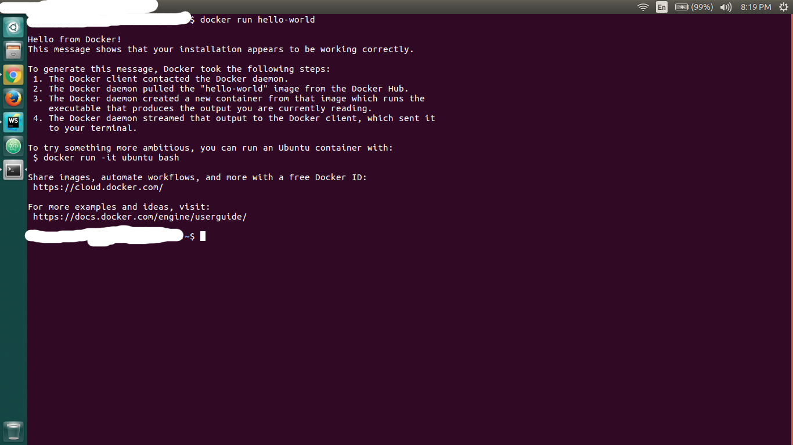

# Cài đặt Docker
## Ubuntu - Linux version
### 1. Yêu cầu
Các bạn cần cài bản 64-bit của các phiên bản Ubuntu sau
- Yakkety 16.10
- Xenial 16.04 (LTS)
- Trusty 14.04 (LTS)

Cài đặt gói phần mềm cần thiết theo khuyến cáo của Docker:

```sh
$ sudo apt-get update
$ sudo apt-get install -y --no-install-recommends \
      linux-image-extra-$(uname -r) \
      linux-image-extra-virtual
```
### 2. Cài đặt Docker
#### a. Cài repository cho Ubuntu
Cài các gói để ```apt ``` có thể cài repository bằng HTTPS

```sh
$  sudo apt-get install -y --no-install-recommends \
      apt-transport-https \
      ca-certificates \
      curl \
      software-properties-common
```
Thêm GPG key cho Docker

```sh
$ curl -fsSL https://apt.dockerproject.org/gpg | sudo apt-key add -
```

Check GPG key là ```58118E89F3A912897C070ADBF76221572C52609D```

```sh
$ apt-key fingerprint 58118E89F3A912897C070ADBF76221572C52609D

  pub   4096R/2C52609D 2015-07-14
        Key fingerprint = 5811 8E89 F3A9 1289 7C07  0ADB F762 2157 2C52 609D
  uid                  Docker Release Tool (releasedocker) <docker@docker.com>
```

Sử dụng ```Stable``` repository

```sh
$ sudo add-apt-repository \
       "deb https://apt.dockerproject.org/repo/ \
       ubuntu-$(lsb_release -cs) \
       main"
```
#### b. Cài đặt Docker
Update hệt thống

```sh
$ sudo apt-get update
```

Cài đặt Docker bằng repository chúng ta đã setup ở trên

```sh
$ sudo apt-get -y install docker-engine
```

Kiểm tra cài đặt Docker

```sh
$ sudo docker run hello-world
```

Kết quả nhận được như sau nghĩa là bạn đã cài thành công



### 3. Cài đặt docker-compose

Sử dụng lệnh sau để cài compose

```sh
$ curl -L "https://github.com/docker/compose/releases/download/1.11.1/docker-compose-$(uname -s)-$(uname -m)" -o /usr/local/bin/docker-compose
```

Cấu hình phân quyền cho docker-compose

```sh
$ chmod +x /usr/local/bin/docker-compose
```

Kiểm tra cài đặt

```sh
$ docker-compose --version

docker-compose version: 1.11.1
```
